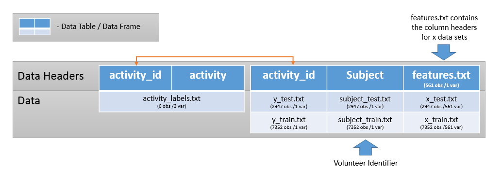

##Introduction

This document will walk through the steps taken to create the "Activity_Recognition_Data_Avg.csv" file from the txt files provided for the project in the "getdata_projectfiles_UCI_HAR_Dataset.zip". 

###Steps

The code is separated into the following sections and this README document will go through each step to help understand the process used to manipulate the raw data set

* Set Libraries
* Download data
* Raw data locations
* Read in raw data
* Profile raw data
* Merge training and test sets into 1 table
* Extract only measurements on the mean and standard deviation
* transform into tidy data set
* get value averages
* remove duplicates and leave only averages

##Set Libraries

For this project the "dplyr" library was used. I also read in the "sqldf" in case I was not able to manipulate the data using "dplyr".

##Download data

This section downloads the sample data zip file and unzips it to a location on my desktop for reading in.

##Raw data locations

This section defines the folder paths where my work is being done as well as the Here the folder paths of the raw data files that will be used for this project. 

##Read in raw data

This section reads in the following txt files:

* features.txt
* activity_labels.txt
* X_test.txt
* y_test.txt
* subject_test.txt
* X_train.txt
* y_train.txt
* subject_train.txt

##Profile raw data

This section performed several tests to determine how the data should be combined.

1) Confirm that the records in subject_train.txt and subject_test.txt refer to the 30 volunteers referred to in the raw data's README file. By examining these data sets I found that these files contained values of 1-30 that should refer to the volunteers. 21 volunteers appear only in the train set and 9 volunteers only appear in the test set.
2) Determine what the data in y_train.txt and y_test.txt refer to. These tables only contained 6 values 1-6 which I inferred to be connected to the activity_labels.txt table which contained an identifyer column (1-6) and a description column with the actions that the volunteer would have been performing when the data was created.
3) Confirm that features.txt is a list of column headers. It appeared that the list of 565 titles refer to the headers for the data tables in X_train.txt and X_test.txt

Through this and other research I determined that the data should fit together as displayed in the diagram below:

 

##Merge training and test sets into 1 table

This section uses the logic from the diagram above to creat a table called "Activity_Recognition_Data" which is a combined table that consolidates data from all of the following raw data sources read in. The code is well commented and should explain the exact method that this was accomplished.

##Extract only measurements on the mean and standard deviation

This section identifies the columns that refer to a mean or standard deviation. In order to achieve this I searched for any column name containing either "mean()" (defined as "Mean value" in features_info.txt) or "std()" (defined as "Standard deviation" in features_info.txt). 

After identifying the 66 columns containing those 2 strings, I ran a loop to create a new table called "Activity_Recognition_Data_2" that contained only the fields "Subject" , "activity_id" ,"row_id" , "activity" and the 66 columns with either "mean()" or "std()" in the name.

##Transform into tidy data set

This section transforms the table into a more tidy data set by following the steps below

1) Use the `gather` function to turn the 66 columns of means and standard deviations into 2 columns. 1 column containing the column names and 1 column containing the columns value.
2) Use the `split` function to divide "measurement type" (the column names) into 4 columns:
  * column_no - removed because no longer necessary
  * MeasurementType
  * Calculation
  * Axis
3) Use the `Spread` function to distribute mean and standard deviation into their own columns

These steps are all taken to create the "Activity_Recognition_Data_4" table which should meet the first 4 criteria of this project's assignment.

##Get value averages

This section uses the `group_by` and `mutate` function in conjunction to create 2 new columns called "mean_avg" and "std_avg"" which are aggregated averages of the mean and standard deviation columns existing in the table when grouping the data by "Subject", "activity", "MeasurementType", and "Axis" creating the "Activity_Recognition_Data_Avg". The grouping fields are fields that in conjunction separate the data into unique subject and actvity. There are other less granular aggregations that could have performed such as simply "Subject" and "activity" but I used this level of aggregation to maintain the most granular level of aggregation to facilitate further analysis without significantly taking away the ability to slice and dice the data.

##Remove duplicates and leave only averages

This section removes the "row_id", "mean" , and "std" columns and then takes away remaining duplicates to create and save the "Activity_Recognition_Data_Avg_2" table to the desktop as "Activity_Recognition_Data_Avg.csv". This leaves only the aggregated data to be used for clean analysis.